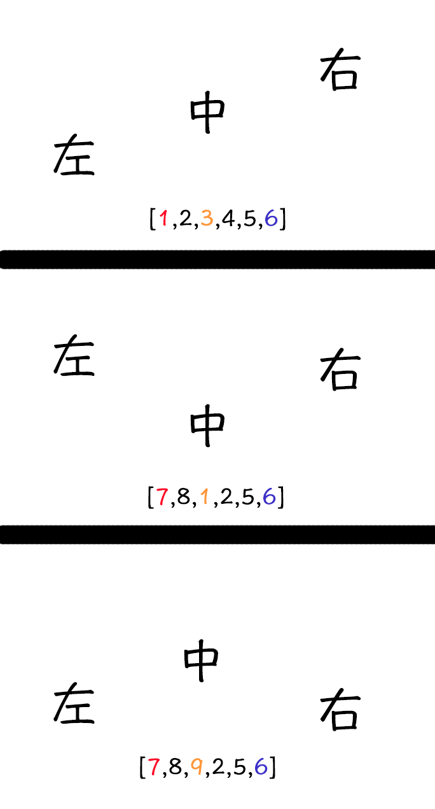
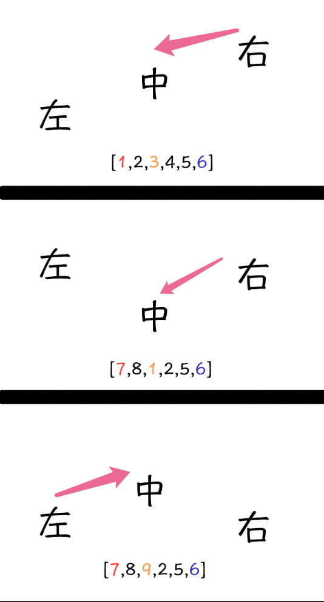

## 练习：[搜索旋转数组](https://leetcode-cn.com/problems/search-rotate-array-lcci/)

探索一个更为复杂的特定条件搜索。

### 题目说明

搜索旋转数组。给定一个排序后的数组，包含n个整数，但这个数组已被旋转过很多次了，次数不详。请编写代码找出数组中的某个元素，假设数组元素原先是按升序排列的。若有多个相同元素，返回索引值最小的一个。

```cpp
 输入: arr = [15, 16, 19, 20, 25, 1, 3, 4, 5, 7, 10, 14], target = 5
 输出: 8（元素5在该数组中的索引）
```


### 思路

1. 不论旋转多少次，数组最多变成不同地连续的两段。

2. 这道题很明显的可以分为两步，第一步查找到旋转点的位置，将原数组分成两段，第二步确定目标查找值在哪一段，再进行一次二分查找。
3. 由于数组中会出现重复的数字，要考虑特殊情况,如[5,4,3,2,1,5,5,5]这种情况。


### Step 1 处理首尾相同的情况

由于题目说明**若有多个相同元素，返回索引值最小的一个**，所以对于首尾相同的情况[5,4,3,2,1,5,5,5]，后面的重复元素肯定不是答案，直接删除末尾的重复元素就行。

```cpp
int first = arr[0],cnt = arr.size() - 1;
while(cnt >= 0 && arr[cnt]==first){
  cnt--;
}
//这里没有对原数组进行改变，仅是记录了最后一个不重复索引的位置
```


### Step 2 搜索旋转点位置

由于在第一步已经对数组进行了简化，不会再出现首尾相同的情况，那么进行旋转点的查找其实变成了查找数组中**最小的数**的索引。

回顾之前的方法，要考虑以下3点：

1. 退出循环的条件是`left > right`还是`left = right`。
2. 当`nums[mid]==target`时，更新左边界还是右边界。
3. 边界更新时是否需要包含`mid`，如果需要，是哪个边界需要。

对于`2`而言，类似于这种题目，并没有所谓的`target`，这种时候`nums[mid]`的比较对象就是左边界值`nums[left]`或`nums[right]`，所以需要考虑的要加上一条：

4. 比较对象是左边界还是右边界。

由于比较对象分割的是左右边界的更新，所以只需判断`nums[mid]`和哪个边界比较能分割开边界的更新，例如这道题，分析左边界值，中间值，右边界值可能出现的情况：

<center><br><div style="border-bottom: 1px solid #d9d9d9;display: inline-block;color: #000;padding: 2px;">图1 </div></center>

判断每种情况，是哪个边界更新：

<center><br><div style="border-bottom: 1px solid #d9d9d9;display: inline-block;color: #000;padding: 2px;">图2 </div></center>

通过观察可以发现，当更新右边界时(图中上层的两种),`nums[mid]`总比`nums[right]`小,更新左边界时则反之，而如果将`nums[mid]`与`nums[left]`比较，则无法判断什么时候更新左边界什么时候更新右边界。所以`4`的答案是比较对象是右边界。

>  根据4的分析，以及三点的思考方式，请wch同学补全代码

```cpp
int findIndex(vector<int>& arr,int n){
  int left = 0,right = n - 1;
  while(){
    int mid = left + (right - left)/2;
    
  }
  return ;
}
```


### Step 3 在指定有序数组中搜索指定值

判断`target`在哪一组：

```cpp
int index = findIndex(arr,cnt + 1);
int left = 0,right = cnt;
if(target > arr[cnt])
  right = index - 1;
else
  left = index;
return bs(arr,left,right，target);
```

在有序的数组中进行指定值搜索就比较简单了，要注意的是，由于有相同元素，**若有多个相同元素，返回索引值最小的一个**，所以还是需要之前的三步思考方法进行考虑。

> 根据三点的思考方式，请wch同学补全代码

```cpp
int bs(vector<int>& arr,int left,int right,int target){
  while(){
    int mid = left + (right - left)/2;
    
	}

}
```


### Step 4 检查边界

在step1进行重复元素删除时可能会出现[1,1,1,1,1,1,1,1]这样的数组最终被删的一个不剩，所以要对cnt进行边界检查:

```cpp
cnt = cnt < 0 ? arr.size() - 1 : cnt;
```

